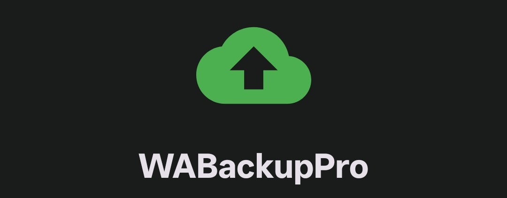

<div align="center">
  
</div>

<br />

# WABackupPro

**Automated background backups of WhatsApp Business databases and media files to Google Drive.**

---

## 📱 At a Glance

| Property | Details |
| :--- | :--- |
| **Application** | WABackupPro (WhatsApp Business Cloud Sync Utility) |
| **Target Audience** | Power users & small businesses needing automated offsite WhatsApp backups |
| **Data Scope** | WhatsApp Business Media (Documents, Images, Video, Audio, Voice Notes) |
| **Destination** | User's personal Google Drive account (`drive.file` scope) |
| **Min / Target SDK** | Android 8.0 (API 26) / Android 14.0 (API 34) |
| **Architecture** | MVVM + Domain Use Cases + Room DB + WorkManager |
| **License** | Proprietary / Internal |

---

## ✨ What Problem Does WABackupPro Solve?

WhatsApp Business stores message databases and media locally on your Android device. Standard personal backups may lack scheduling flexibility, lack per-file execution auditing, or collide with enterprise device management rules.

**WABackupPro** provides an independent, automated utility that:
1. **Scans Local Storage**: Automatically discovers WhatsApp Business media files via Android Scoped Storage (`MediaStore` API).
2. **Saves Data & Battery (Delta Detection)**: Calculates SHA-256 hashes of local files to skip previously backed-up payloads.
3. **Schedules Automated Runs**: Uses Android **WorkManager** to trigger periodic background backups (e.g., every Friday at 2:00 AM) over Wi-Fi.
4. **Maintains Audit Logs**: Stores detailed execution logs and per-file outcomes in a local **Room Database**.
5. **Protects Privacy**: Authenticates via Google Sign-In with minimal `drive.file` OAuth scope—accessing only files created by WABackupPro.

---

## 🧭 Navigation & Screen Map

The application consists of three main bottom-navigation views and dedicated detail screens:

- **Backup Dashboard (`BackupFragment`)**: Monitor active backup progress, view real-time progress bars, inspect audit logs, toggle Demo Mode, or trigger manual backups.
- **Backup History (`BackupHistoryFragment`)**: View past backup runs with real-time text search and status filter chips (`All`, `Success`, `Partial`, `Failed`).
- **Backup Detail (`BackupDetailFragment`)**: Inspect per-file outcomes (`SUCCESS`, `SKIPPED`, `FAILED`) for any historical run and execute single-file retries for failed items.
- **Settings (`SettingsFragment`)**: Configure automated schedules (TimePicker), Wi-Fi constraints, history retention period, selective categories, and force-full-backup overrides.
- **About & Support (`AboutActivity`)**: View app version information, legal terms, and optional developer support actions (Razorpay and UPI).

---

## 🔐 Permissions & Privacy

WABackupPro requests minimal Android permissions:

- **`INTERNET` & `ACCESS_NETWORK_STATE`**: Used to communicate with the Google Drive REST API over Wi-Fi.
- **`READ_EXTERNAL_STORAGE` / Granular Media (`READ_MEDIA_IMAGES`, `READ_MEDIA_VIDEO`, `READ_MEDIA_AUDIO`)**: Required to scan WhatsApp Business media directories via the `MediaStore` API.
- **`RECEIVE_BOOT_COMPLETED`**: Allows `BootReceiver` to reschedule periodic background tasks after device reboots.
- **`FOREGROUND_SERVICE` & `FOREGROUND_SERVICE_DATA_SYNC`**: Promotes long-running uploads to a Foreground Service with an ongoing notification to avoid OS battery termination.

---

## ⚙️ Quick Setup Guide

### Prerequisites
- **Android Studio**: Iguana (2023.2.1) or newer.
- **JDK**: Java Development Kit 17 (configured as Gradle JDK).
- **Android SDK**: Target API 34, Min API 26.

### 1. Google Cloud Console Configuration
1. Open the [Google Cloud Console](https://console.cloud.google.com/).
2. Create a new project named `WABackupPro`.
3. Enable the **Google Drive API** under **APIs & Services > Library**.
4. Configure the **OAuth Consent Screen** (User Type: External, Scope: `.../auth/drive.file`).
5. Under **Credentials**, create an **OAuth 2.0 Client ID** of type **Android**.
6. Enter package name `com.wabackuppro` and your SHA-1 signing key fingerprint.

### 2. Building & Running Locally
Clone the repository and build using the Gradle wrapper:

```bash
# Clone the repository
git clone https://github.com/nandakumar-nandu/WABackupPro.git
cd WABackupPro

# Copy example environment configuration
cp local.properties.example local.properties

# Build the debug APK
gradlew.bat assembleDebug

# Run unit tests
gradlew.bat test
```

---

## 📖 Further Documentation

For deep technical details, development guides, and user manuals, refer to:

- [ARCHITECTURE.md](ARCHITECTURE.md): Technical architecture, data flow, background execution, database schema, and legacy code audit.
- [DEVELOPMENT.md](DEVELOPMENT.md): Developer environment, package layout, coding standards, and build instructions.
- [USER_GUIDE.md](USER_GUIDE.md): Novice user manual covering setup, authentication, running backups, reading history, and troubleshooting.
- [CHANGELOG.md](CHANGELOG.md): Historical record of release features and improvements.

---
*WABackupPro Version 1.3.0 · Maintained by Antigravity DeepMind Team*
