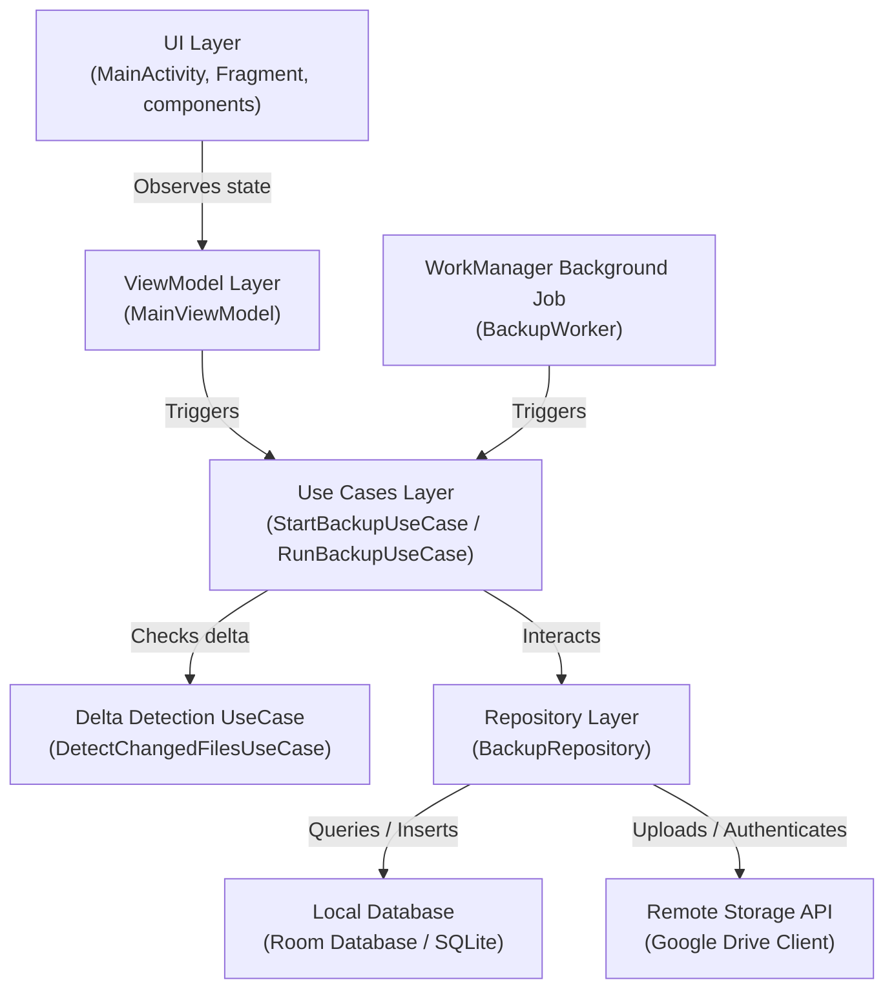
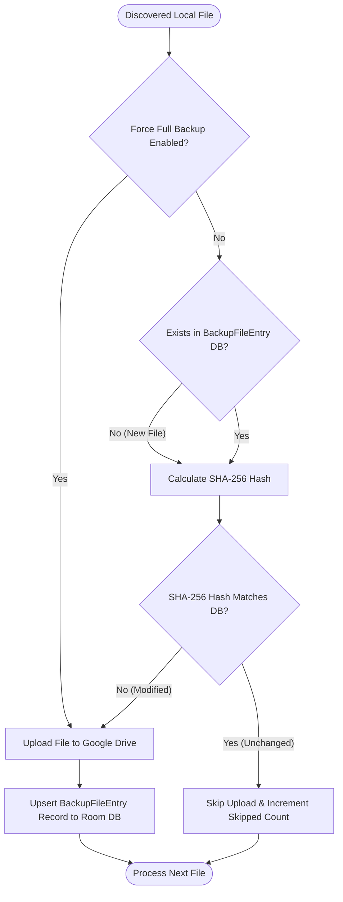
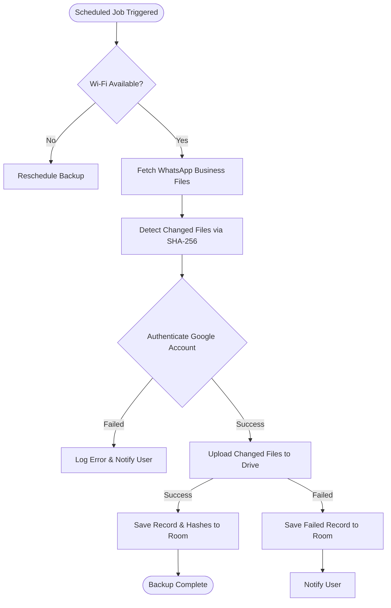
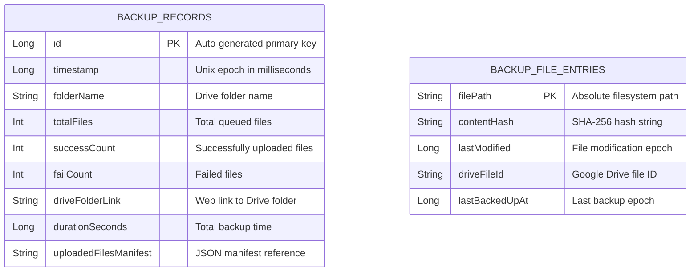
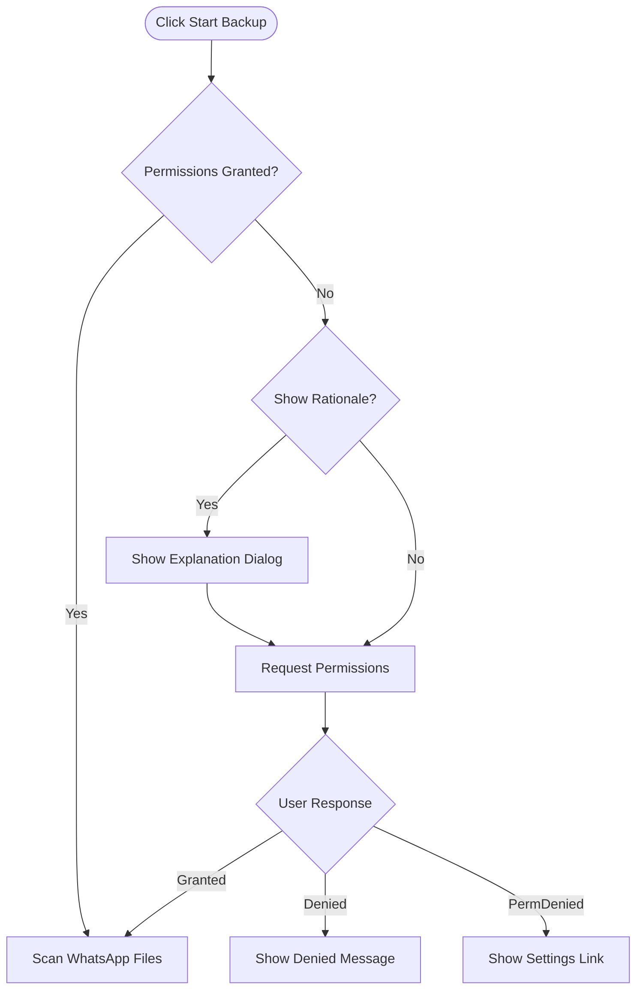
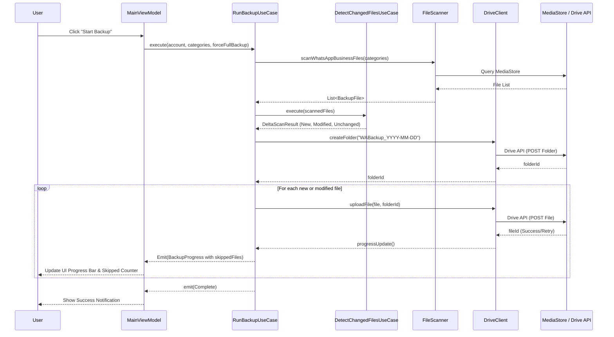

# WABackupPro

    

Automated background backups of WhatsApp Business databases and files to Google Drive.

## App Concept
**WABackupPro** is designed to provide secure, automated backups of WhatsApp Business database files (e.g., `msgstore.db.crypt14`) and media assets directly to a user's Google Drive account. Utilizing WorkManager for reliable background job execution, Room for storing audit history logs and SHA-256 delta manifests, and the Google Drive REST API, the application runs incrementally in the background without affecting daily productivity.

## Backup Categories Mapping Table

| Category | Extensions | MIME Types | WhatsApp Directory Path |
| :--- | :--- | :--- | :--- |
| **DOCUMENTS** | `.pdf`, `.docx`, `.xlsx`, `.pptx`, `.txt`, `.csv`, `.zip` | `application/pdf`, `application/msword`, `text/plain` | `WhatsApp Business/Media/WhatsApp Documents/` |
| **IMAGES** | `.jpg`, `.jpeg`, `.png`, `.webp`, `.gif` | `image/jpeg`, `image/png`, `image/webp` | `WhatsApp Business/Media/WhatsApp Images/` |
| **VIDEO** | `.mp4`, `.3gp`, `.mkv`, `.webm`, `.avi` | `video/mp4`, `video/3gpp`, `video/x-matroska` | `WhatsApp Business/Media/WhatsApp Video/` |
| **AUDIO** | `.mp3`, `.aac`, `.wav`, `.flac` | `audio/mpeg`, `audio/aac`, `audio/wav` | `WhatsApp Business/Media/WhatsApp Audio/` |
| **VOICE_NOTES** | `.opus`, `.m4a`, `.ogg` | `audio/opus`, `audio/ogg`, `audio/aac` | `WhatsApp Business/Media/WhatsApp Voice Notes/`, `PTT/` |

## Architecture

This application adheres to **MVVM + Clean Architecture** guidelines to decouple dependencies and make the codebase highly testable.

### App Architecture Layers Diagram


### Delta Detection & Incremental Backup Decision Tree


### Automatic WorkManager Scheduling Flow
```mermaid
graph TD
    Boot[Device Boot or App Launch] --> Schedule{BackupScheduler}
    Schedule -->|Calculate delay to Friday| Enqueue[PeriodicWorkRequest]
    Enqueue --> WM((WorkManager Engine))
    WM --> Constraint{Check Constraints<br/>(Wi-Fi, Battery)}
    Constraint -- Not Met --> Waiting[Wait for conditions]
    Constraint -- Met --> Worker[BackupWorker runs]
    Worker --> Foreground[Promote to Foreground Service]
    Worker --> DeltaCheck[Perform Delta Scan]
    DeltaCheck --> UseCase[RunBackupUseCase executes]
```

### Backup Workflow Flowchart


### Room Database Entity-Relationship (ER) Diagram


### Permission Request Flow


### Full Backup Orchestration Sequence


## Setup Prerequisites

To set up and run this application locally, you will need:

1. **Android Studio**: Android Studio Iguana (2023.2.1) or newer.
2. **Android SDK**: API level 26 (Android 8.0) minimum, compiled and targeted to API level 34 (Android 14.0).
3. **Java Development Kit**: JDK 17 (set as Gradle JDK in Android Studio settings).

### 1. Google Cloud Console Setup
To enable Google Sign-In and Google Drive API integration:
1. Go to the [Google Cloud Console](https://console.cloud.google.com/).
2. Create a new Project (e.g., "WABackupPro").
3. Navigate to **APIs & Services > Library**.
4. Search for **Google Drive API** and click **Enable**.
5. Navigate to **APIs & Services > OAuth consent screen**.
   - Set User Type to **External**.
   - Add `.../auth/drive.file` scope (allows app to access only files it creates).
6. Navigate to **APIs & Services > Credentials**.
7. Click **Create Credentials** > **OAuth client ID**.
8. Select **Android** as the application type.
9. Enter your package name (`com.wabackuppro`) and your debug/release **SHA-1 certificate fingerprint**.
10. *(Optional for Web/Backend)* Create another OAuth client ID of type **Web application** and copy the Client ID. Place this in your `local.properties` file as `google.web.client.id`.

### 2. Local Environment Setup
1. Clone the repository:
   ```bash
   git clone https://github.com/nandakumar-nandu/WABackupPro.git
   ```
2. Create a `local.properties` file in the root project directory (use `local.properties.example` as a reference):
   ```properties
   google.web.client.id=YOUR_WEB_CLIENT_ID_HERE
   ```
3. Copy `.env.example` to `.env` if you need to configure additional runtime variables.
4. Sync Gradle and build the project in Android Studio.

## Contribution

This project is fully built and maintained. 🚀 
To report issues or suggest features, feel free to open a GitHub Issue!
