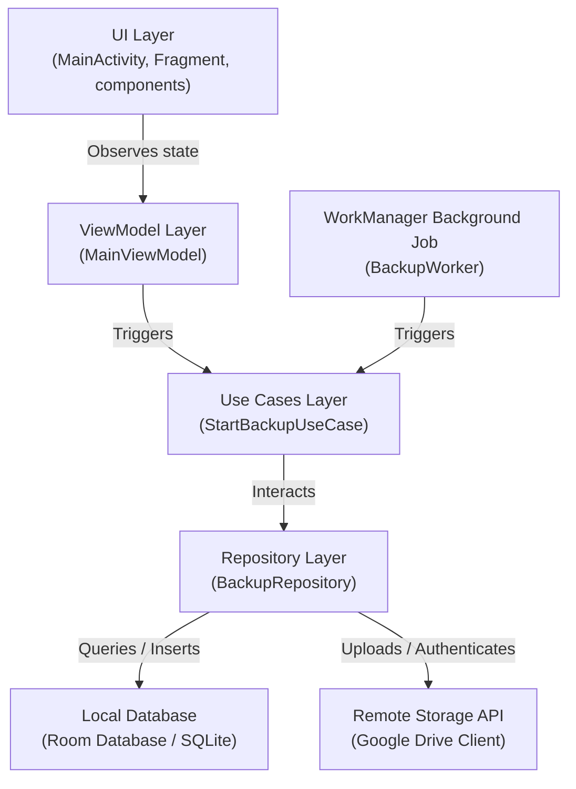
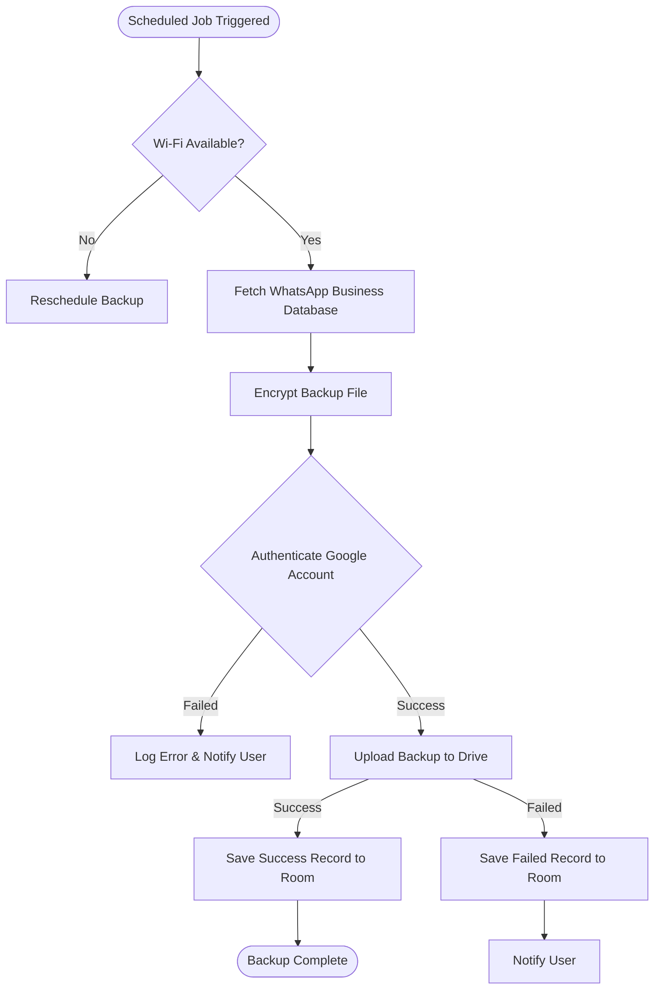
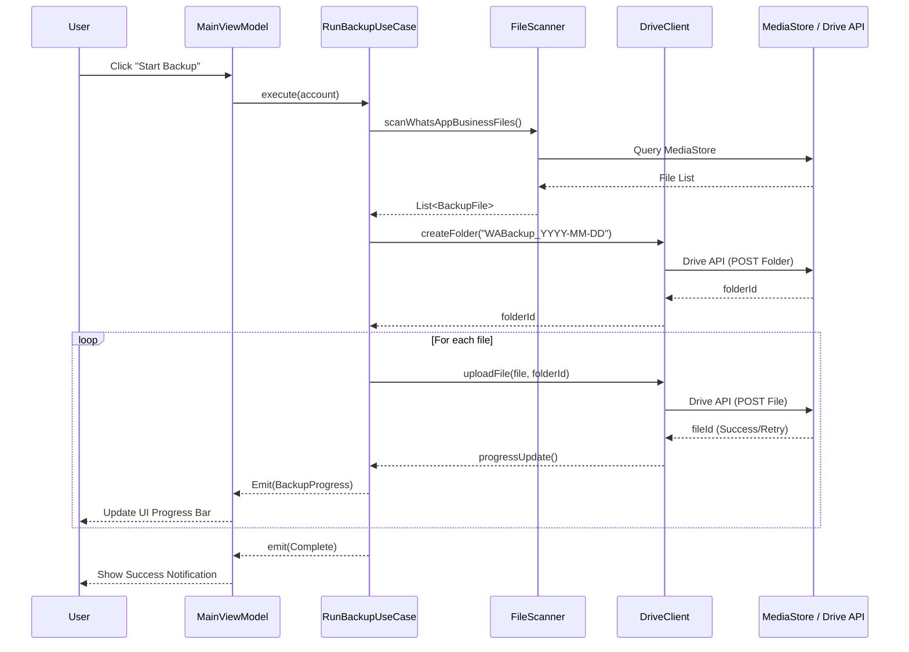

# WABackupPro

Automated background backups of WhatsApp Business databases and files to Google Drive.

## App Concept
**WABackupPro** is designed to provide secure, automated backups of WhatsApp Business database files (e.g., `msgstore.db.crypt14`) and media assets directly to a user's Google Drive account. Utilizing WorkManager for reliable background job execution, Room for storing audit history logs, and the Google Drive REST API, the application runs incrementally in the background without affecting daily productivity.

## Architecture

This application adheres to **MVVM + Clean Architecture** guidelines to decouple dependencies and make the codebase highly testable.

### App Architecture Layers Diagram

### Backup Workflow Flowchart

### Permission Request Flow

### Full Backup Orchestration Sequence

## Setup Prerequisites

To set up and run this application locally, you will need:

1. **Android Studio**: Android Studio Hedgehog (2023.1.1) or newer.
2. **Android SDK**: API level 26 (Android 8.0) minimum, compiled and targeted to API level 34 (Android 14.0).
3. **Java Development Kit**: JDK 17 (set as Gradle JDK in Android Studio settings).
4. **Google Cloud Console Setup**:
   - **Step 1: Create Project**: Go to [Google Cloud Console](https://console.cloud.google.com/) and create a project named "WABackupPro".
   - **Step 2: Enable APIs**: Search for and enable the **Google Drive API**.
   - **Step 3: Configure Consent Screen**:
     - Set User Type to **External**.
     - Add `.../auth/drive.file` scope (allows app to access only files it creates).
   - **Step 4: Create Credentials**:
     - Create an **OAuth 2.0 Client ID** for **Android**.
     - Package name: `com.wabackuppro`.
     - SHA-1 fingerprint: Obtain via `./gradlew signingReport`.
5. **Local configuration**:
   - Copy `.env.example` to `.env` and fill in client parameters.
   - Configure local.properties with actual `google.client.id` and `google.client.secret`.
