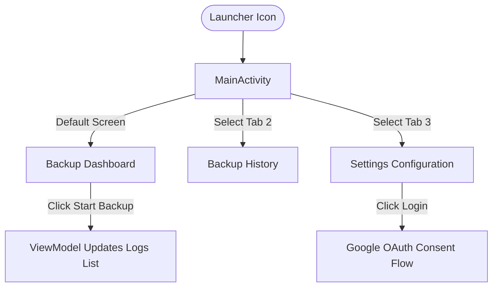

# Screen Tour: WABackupPro

This document gives an overview of the screens configured in the initial scaffolding of WABackupPro.

## Planned Screens

### 1. Backup Dashboard (Main Screen)
- **Purpose**: Displays the status of the automated backup service, shows the date of the last run, and provides a manual trigger button.
- **Visual Structure**:
  - **Header Toolbar**: App title "WABackupPro".
  - **Status Card**: Employs a cloud indicator showing states like "No backup run yet", "Backup in progress...", or "Backup complete".
  - **Action Button**: Large "Start Backup Now" button.
  - **Progress Indicators**: 
    - **Linear Progress Bar**: Animates as files are uploaded.
    - **Status Labels**: Shows "Uploading X of Y files" and the name of the current file (e.g., `msgstore.db.crypt14`).
  - **Auth & Test Row**: 
    - **Login to Drive**: Triggers the Google Sign-In overlay. Changes to "Sign Out (email)" once authenticated.
    - **Test Upload**: Enabled only after login. Uploads a dummy file to verify end-to-end connectivity.
  - **Logs Section**: Displays real-time progress, including success (`✅`) or failure (`❌`) badges for every file.

### 2. Backup Progress Screen
- **Real-time Updates**: The screen remains active during the backup process, providing visual feedback of the upload queue.
- **Background Persistence**: If the user leaves the screen, the progress bar state is maintained by the `MainViewModel`.

### 3. Backup Notification (Foreground Service)
- **Purpose**: Shown automatically when a scheduled WorkManager background backup is executing.
- **Visual Structure**:
  - **Ongoing Badge**: The notification is persistent and cannot be swiped away while the backup is active.
  - **Progress Information**: Displays the current status of the upload (e.g. "Uploading msgstore.db.crypt14 (2 of 5)...").
  - **Service Priority**: Elevates the background worker to avoid being terminated by OS battery optimizations (Doze mode).

### 4. Google Sign-In
- **Overlay**: The standard system-provided Google Account picker.
- **Scopes Request**: Clearly informs the user that the app wants to "See, edit, create, and delete only the specific Google Drive files you use with this app."

### 3. Permissions Flow
- **Rationale Dialog**: An `AlertDialog` that appears if the user previously denied permissions, explaining why access to media is required.
- **System Prompt**: The standard Android permission request dialog.
- **Denied Message**: A `Snackbar` with a "Settings" button that appears if permissions are permanently denied, allowing users to manually enable them.

### 2. Backup History Screen
- **Purpose**: Displays a comprehensive, chronological list of all past backups retrieved from the local Room database.
- **Visual Structure**:
  - **RecyclerView**: A scrollable list displaying individual cards for each backup job.
  - **Record Card**: Shows the formatted timestamp (e.g., Jul 18, 2026), file processing metrics (Success: 150, Failed: 0), and total upload duration.
  - **Status Badge**: Visually indicates outcome with color coding (Green for SUCCESS/PARTIAL, Red for FAILED).
  - **Action Link**: An "Open in Drive" text button that launches a browser or the Drive app to view the backed-up files.

### 3. Settings Screen
- **Purpose**: The configuration hub for authentication, constraints, and scheduling.
- **Visual Structure**:
  - **Schedule Controls**: A labeled row with a button triggering an Android `TimePickerDialog` to set the Friday backup time.
  - **Network Constraints**: A modern `MaterialSwitch` to enforce Wi-Fi-only uploads.
  - **History Management**: An inline `EditText` field allowing the user to specify how many days to retain backup history.
  - **Account Integration**: Displays the currently signed-in Google email address, along with a prominent "Sign Out" button.
  - **Manual Trigger**: A distinct button at the bottom providing a quick shortcut to "Run Backup Now" without leaving the settings screen.

## Screen Navigation Map

