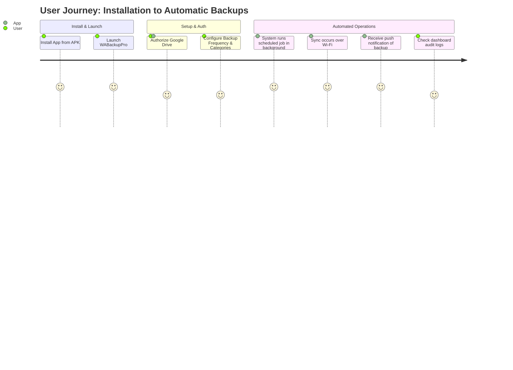

# Walkthrough: WABackupPro

## Why this app exists (The Problem)

WhatsApp Business stores message databases and media locally on devices. While WhatsApp offers personal automated backups to Google Drive, WhatsApp Business backup behaviors can sometimes be restricted by enterprise policies, lack scheduling flexibility, or be difficult to export. Enterprise and power users need an independent, granular, and automated utility to:
- Schedule backups at exact intervals (e.g., hourly or daily).
- Store history records of backups.
- Save backups securely in the App Data space on Google Drive, preventing manual deletions or visibility from other file browsers.

This app bridges this gap by offering a dedicated background scheduler that runs silently in the background, monitors WhatsApp database updates, and sends them to Google Drive.

## Google Drive Setup (Implementation)

The application uses the **Google Drive REST API v3** combined with **Google Play Services Auth**.

1. **Authentication (Least Privilege)**:
   - The app requests the `https://www.googleapis.com/auth/drive.file` scope.
   - **Why?** This scope provides access only to files and folders created or opened by the app itself. It prevents the app from seeing the user's personal documents, adhering to the principle of least privilege.
2. **Folder Creation**:
   - On the first backup or test run, the app checks for/creates a dedicated folder (e.g., `WABackup_Test` or `WABackupPro_Backups`).
3. **Resilient Uploads**:
   - Files are uploaded using `FileContent`, which handles the binary stream efficiently.
   - Every upload is logged in the `Activity Logs` with its unique Drive File ID for auditing.

## Automatic Scheduling (Implementation)

1. **WorkManager Initialization**:
   - Background scheduling is managed by the `BackupScheduler` utility. When the user sets a weekly backup (e.g. every Friday), the scheduler calculates the exact delay until the next upcoming Friday at the chosen time.
2. **Periodic Constraints**:
   - The backup job is queued as a `PeriodicWorkRequest` running every 7 days. It respects OS constraints by running only when the device is connected to Wi-Fi (`NetworkType.UNMETERED`) and the battery is not low.
3. **Foreground Service Promotion**:
   - Because WhatsApp backups can be large and take longer than the 10-minute WorkManager background limit, the `BackupWorker` immediately promotes itself to a Foreground Service (`setForeground()`). This gives the app a higher priority execution state and shows a persistent notification.
4. **Boot Resilience**:
   - A `BootReceiver` is registered to listen for `ACTION_BOOT_COMPLETED`. If the device is restarted, it instantly reschedules the WorkManager task so the user doesn't miss their scheduled Friday backup.

## How the backup works (Planned Mechanism)

1. **Scheduling**:
   - The user opens the app and links their Google Drive account.
   - The app schedules a recurring `PeriodicWorkRequest` using WorkManager.
2. **File Scanning**:
   - The app uses the `MediaStore` API to query for files in the `WhatsApp Business` media folder.
   - It filters for specific types: `.pdf`, `.docx`, `.xlsx`, `.jpg`, `.png`, and `.mp4`.
   - On Android 13+, it requests granular media permissions (`READ_MEDIA_IMAGES`, `READ_MEDIA_VIDEO`), while on older versions it uses `READ_EXTERNAL_STORAGE`.
3. **Transmission**:
   - The app verifies network constraints (ensuring Wi-Fi is active to save mobile data).
   - Using the authenticated Google Drive client, it uploads the encrypted database file to the user's Google Drive application metadata folder (`appDataFolder`).
4. **Logging & Monitoring**:
   - Each run inserts a status entry (`SUCCESS` or `FAILED`) into the Room database.
   - The main dashboard updates the status card and recyclerView log list in real-time.

## Incremental Backups (Implementation v1.1.0)

1. **SHA-256 Content Hashing**:
   - `DetectChangedFilesUseCase` calculates a SHA-256 cryptographic hash for every discovered WhatsApp file payload rather than relying on modification dates alone.
   - **Why?** Modification timestamps can be misleading due to device clock drift, timezone shifts, or file copying actions. Cryptographic content hashing guarantees strict integrity verification.
2. **Delta Categorization**:
   - Files are categorized into three buckets: `newFiles`, `modifiedFiles`, and `unchangedFiles`.
   - `unchangedFiles` are skipped, conserving bandwidth, Drive API quota, and battery life.
3. **Room Entity Persistence**:
   - `BackupFileEntry` records `filePath`, `contentHash`, `lastModified`, `driveFileId`, and `lastBackedUpAt` in Room Database table `backup_file_entries`.
4. **Force Full Backup Manual Override**:
   - Users can toggle "Force Full Backup" in Settings (`PREF_FORCE_FULL_BACKUP`). This acts as an emergency escape hatch to re-upload all files if local database state or remote manifests become corrupted.

## Choosing What to Back Up (Implementation v1.2.0)

1. **Selective Categories Model**:
   - `BackupCategory` enum defines 5 distinct media and document types: `DOCUMENTS`, `IMAGES`, `VIDEO`, `AUDIO`, and `VOICE_NOTES`.
2. **Directory & Path Rule Separation**:
   - `FileScanner` classifies media by evaluating file extensions, MediaStore MIME types, and filesystem directory paths.
   - **Voice Notes Distinction**: Voice messages located in `WhatsApp Voice Notes/` or `PTT/` folders are separated into the `VOICE_NOTES` category, keeping them distinct from general music tracks or audio clips (`AUDIO`).
3. **User Category Preferences**:
   - Toggles in Settings (`PREF_CAT_*`) allow users to selectively enable/disable any category. "Select All" and "Select None" quick action buttons simplify mass toggling.
4. **Empty Selection Short-Circuiting**:
   - If a user deselects all categories, `RunBackupUseCase` short-circuits immediately with a friendly notice ("Nothing selected"), preventing unnecessary folder creation and API request overhead.

## Reviewing Backup Details (Implementation v1.3.0)

1. **Per-File Database Persistence**:
   - Every file evaluated during a backup run (uploaded, skipped, or failed) is saved into Room DB table `backup_file_results` linked by foreign key `backupRecordId`.
2. **Drill-Down Inspection**:
   - Tapping any history record card in `BackupHistoryFragment` opens `BackupDetailFragment`.
   - Displays a header card with backup timestamp, total duration, and direct Google Drive link, followed by a list of per-file outcomes with clear visual status indicators (`✅ SUCCESS`, `❌ FAILED`, `⏭️ SKIPPED`).
3. **Single-File Retry Engine**:
   - Tapping a `FAILED` item displays an error detail dialog showing the exact exception message.
   - Clicking "Retry This File" invokes `DriveClient.uploadFile` for that specific item. Upon success, its status in `BackupFileResultDao` is updated from `FAILED` to `SUCCESS`, updating the UI reactively.
4. **History Search & Filter Controls**:
   - History screen features an interactive search bar (`et_search_history`) to search records by date or folder name.
   - Four Material3 status filter chips (`All`, `Success`, `Partial Failures`, `Failed`) allow instant client-side list filtering without triggering redundant database re-queries.

## Running a Manual Backup (Implementation)

1. **Triggering the Job**:
   - When the user taps "Start Backup Now", the `MainViewModel` invokes the `RunBackupUseCase`.
2. **Sequential Orchestration**:
   - The use case first scans the local storage to build a list of files.
   - It then establishes a date-stamped folder on Google Drive.
   - Files are uploaded sequentially to prevent network congestion and to allow granular progress tracking.
3. **Progress & Feedback**:
   - Every file upload emits a state change. The UI reacts by updating the `LinearProgressIndicator` and appending a record to the `Activity Logs`.
4. **Error Handling & Retries**:
   - If a file upload fails (e.g., due to a temporary network timeout), the `RunBackupUseCase` automatically retries the operation up to **3 times**.
   - After all retries are exhausted, the file is marked as failed (`❌`), and the process moves to the next file to ensure the entire backup isn't stalled by a single corrupted or missing item.

## Backup History (Implementation)

1. **Local Database**:
   - The app uses Android Room to maintain a structured schema of all past backup executions in the `backup_records` table.
2. **Metadata Tracking**:
   - Every backup completion (or failure) inserts a `BackupRecord` capturing the precise timestamp, the generated Drive folder name, total files processed, success/failure counts, the Google Drive web link, and the overall duration.
3. **UI Display**:
   - The Backup History screen observes the Room Database reactively using Kotlin Flows.
   - A `RecyclerView` presents the records from newest to oldest, with visual status badges (Success, Partial, Failed).
   - Each history card displays a per-category file breakdown (e.g. `"12 docs · 340 photos · 8 videos"`).
   - If a valid Drive link is captured, an "Open in Drive" button is displayed directly on the card.

## Settings & Preferences (Implementation)

1. **User Customization**:
   - The Settings screen exposes a variety of configurable options stored in `SharedPreferences`.
2. **Scheduling Controls**:
   - A time picker dialog allows users to choose the exact time their weekly Friday backup triggers. Upon selection, the WorkManager scheduler is immediately updated.
3. **Operational Constraints**:
   - A Wi-Fi only toggle is available, which internally maps to the WorkManager `NetworkType.UNMETERED` constraint.
4. **Category Selection Panel**:
   - Individual category switches allow fine-grained control over Documents, Images, Videos, Audio, and Voice Notes backups.
5. **Data Management**:
   - Users can configure the historical retention period (e.g., keep records for 30 days). The DAO supports cleaning up old records based on this threshold.
6. **Account Controls**:
   - The screen shows the currently authenticated Google Account and provides a single-tap sign-out action, which revokes local access and clears the UI state.
7. **Manual Trigger & Escape Hatch**:
   - A "Force Full Backup" switch overrides delta detection to force full file uploads.
   - For convenience, a "Run Backup Now" shortcut bypasses the schedule and launches the background backup process immediately.

## Resilience & Edge Case Handling (v1.0.0)

1. **Drive Quota Exceeded**: 
   - Upload requests returning a `403` or `quotaExceeded` are caught instantly. The UI notifies the user that their Drive is full without attempting futile retries.
2. **Network Drops**: 
   - A standard `IOException` during background upload is bubbled up to WorkManager as `Result.retry()`. WorkManager halts the backup and seamlessly resumes it once the network constraint (Wi-Fi) is satisfied again.
3. **Authentication Expiry**: 
   - If the OAuth token expires (`401 Unauthorized`), the UseCase flags it via an `AuthExpiredException`. The UI catches this state and provides a clear "Retry Backup" button, prompting the user to sign in again if necessary.
4. **No Files Found**:
   - If the scanner finds an empty WhatsApp directory, the UseCase emits a `NoFilesFoundException` with a friendly user-facing message instead of proceeding with an empty folder creation on Drive.

## User Journey Flowchart

---
**This marks the complete architectural walkthrough of WABackupPro (v1.3.0)! 🚀**
